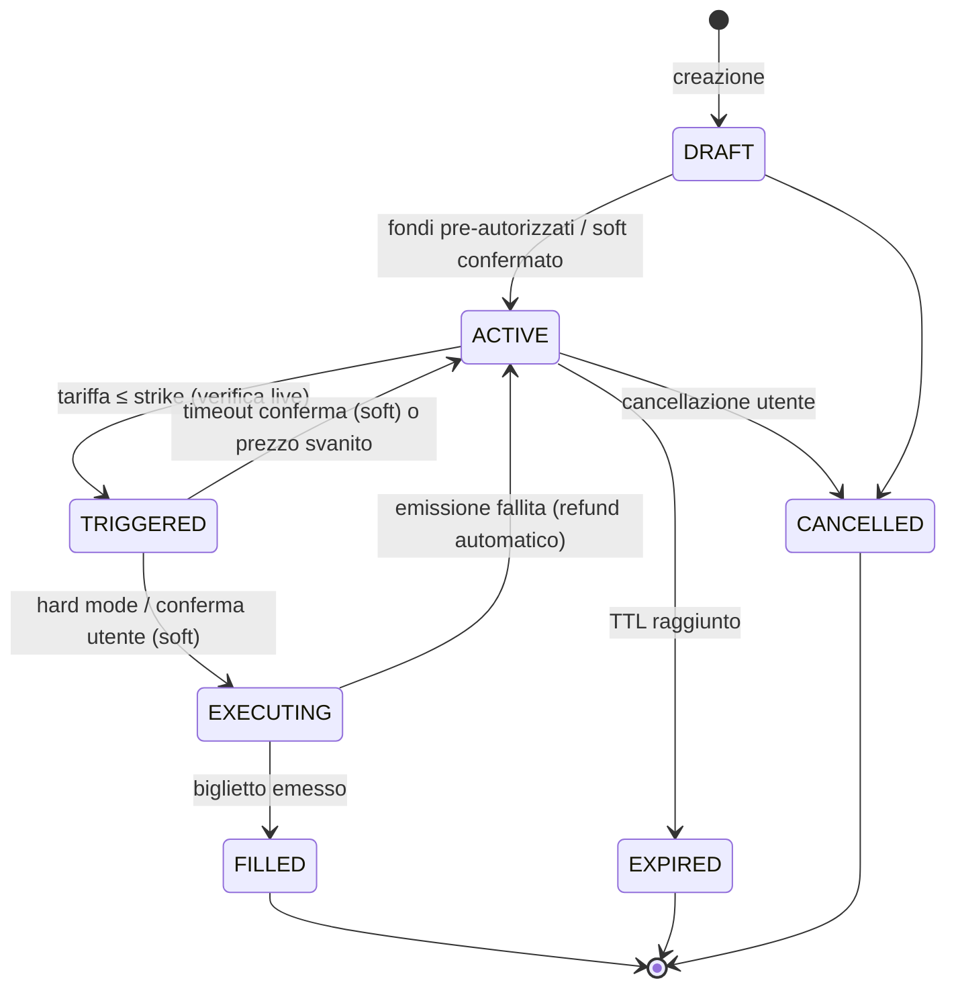
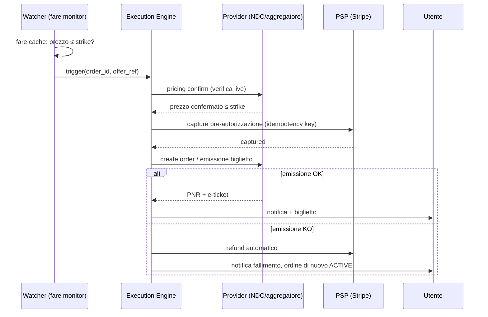
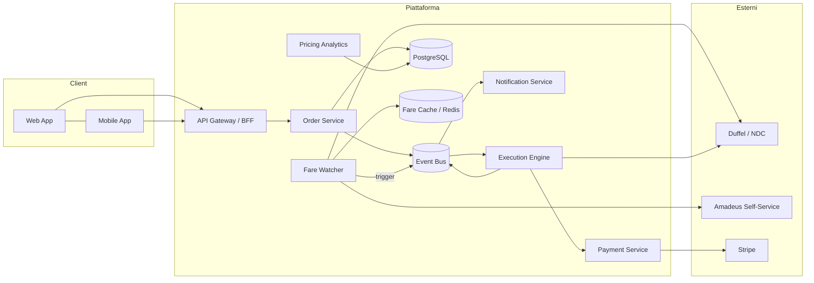

# Flight Stock — Documento di Sviluppo

> **Soluzione SaaS per l'acquisto automatico di biglietti aerei a condizioni pre-impostate.**
> Sistema di *Put/Buy* su voli di linea: l'utente definisce le condizioni di acquisto (ordine condizionato), la piattaforma monitora le tariffe e finalizza l'acquisto quando le condizioni si verificano.

- **Versione documento:** 0.3 (draft)
- **Data:** 2026-07-28
- **Stato:** In definizione — decisioni di prodotto iniziali confermate (v. §20)

---

## Indice

1. [Visione e concetto](#1-visione-e-concetto)
2. [Glossario](#2-glossario)
3. [Attori e personas](#3-attori-e-personas)
4. [Requisiti funzionali](#4-requisiti-funzionali)
5. [Requisiti non funzionali](#5-requisiti-non-funzionali)
6. [User stories principali](#6-user-stories-principali)
7. [Flussi operativi](#7-flussi-operativi)
8. [Architettura di sistema](#8-architettura-di-sistema)
9. [Modello dati](#9-modello-dati)
10. [API — bozza dei contratti](#10-api--bozza-dei-contratti)
11. [Integrazioni esterne](#11-integrazioni-esterne)
12. [Pagamenti e gestione fondi](#12-pagamenti-e-gestione-fondi)
13. [Modello di business](#13-modello-di-business)
14. [Aspetti legali e conformità](#14-aspetti-legali-e-conformità)
15. [Stack tecnologico proposto](#15-stack-tecnologico-proposto)
16. [Roadmap e MVP](#16-roadmap-e-mvp)
17. [Rischi e mitigazioni](#17-rischi-e-mitigazioni)
18. [Metriche di successo (KPI)](#18-metriche-di-successo-kpi)
19. [Domande aperte](#19-domande-aperte)
20. [Decisioni di prodotto confermate](#20-decisioni-di-prodotto-confermate)

---

## 1. Visione e concetto

I prezzi dei voli di linea sono volatili: oscillano in funzione di domanda, load factor, stagionalità e strategie di revenue management delle compagnie. Oggi l'utente che vuole un buon prezzo deve monitorare manualmente le tariffe o affidarsi ad alert passivi (es. notifiche di prezzo) che comunque richiedono un'azione manuale al momento giusto — spesso perso.

**Flight Stock** trasla nel mondo dei biglietti aerei la logica degli **ordini condizionati** dei mercati finanziari:

- L'utente crea un **ordine di acquisto condizionato** ("Put/Buy Order"): rotta, finestra di date, numero passeggeri, classe, vincoli (scali, compagnie, orari) e soprattutto un **prezzo limite** (strike price).
- La piattaforma **monitora continuamente** le tariffe disponibili tramite provider di contenuto aereo (GDS/NDC/aggregatori).
- Quando una tariffa soddisfa **tutte** le condizioni, il sistema **acquista automaticamente** il biglietto (fondi pre-autorizzati) oppure — in modalità "soft" — notifica l'utente con un link di conferma one-tap a tempo.
- L'utente riceve biglietto ed itinerario senza aver dovuto seguire il mercato.

### Proposta di valore

| Per l'utente | Per la piattaforma |
|---|---|
| Compra al prezzo che ha deciso lui, senza monitorare | Commissione per ordine eseguito |
| Zero stress da "quando compro?" | Abbonamenti per utenti frequenti / PMI |
| Trasparenza: condizioni esplicite, nessuna sorpresa | Dati di domanda latente (prezzi desiderati) di grande valore |
| Esecuzione più rapida di qualsiasi umano su tariffe lampo | Posizionamento unico: "limit order per i voli" |

### Cosa Flight Stock NON è

- **Non è un derivato finanziario**: l'utente non specula sul prezzo, acquista un biglietto reale. Nessun regolamento in contanti, nessun mercato secondario (nella fase iniziale).
- **Non è un metamotore di ricerca**: la ricerca è un mezzo, il prodotto è l'esecuzione automatica dell'ordine.
- **Non è un servizio di lock-fare** (blocco tariffa a pagamento), anche se una feature simile è valutabile in roadmap.

---

## 2. Glossario

| Termine | Definizione |
|---|---|
| **Ordine (Put/Buy Order)** | Insieme di condizioni di acquisto definite dall'utente, con validità temporale e prezzo limite. |
| **Strike Price** | Prezzo massimo **per persona** (tasse incluse) che l'utente è disposto a pagare; il totale dell'ordine è strike × n. passeggeri. |
| **Trigger** | Evento in cui una tariffa reale soddisfa tutte le condizioni dell'ordine. |
| **Esecuzione (Fill)** | Acquisto effettivo del biglietto a seguito di un trigger. |
| **Esecuzione parziale** | Per ordini multi-passeggero: acquisto per un sottoinsieme dei passeggeri (se consentito dall'utente). |
| **TTL ordine** | Data/ora di scadenza dell'ordine; oltre, l'ordine decade e i fondi vengono svincolati. |
| **Modalità Hard** | Acquisto completamente automatico con fondi pre-autorizzati. |
| **Modalità Soft** | Al trigger l'utente riceve una notifica e ha N minuti per confermare. |
| **NDC** | New Distribution Capability, standard IATA per la distribuzione di contenuto aereo. |
| **GDS** | Global Distribution System (Amadeus, Sabre, Travelport). |
| **OTA** | Online Travel Agency. |
| **PNR** | Passenger Name Record, il codice di prenotazione. |
| **Fare Cache** | Cache locale delle tariffe osservate, usata per pre-filtrare prima della verifica live. |
| **Watchlist** | Insieme di rotte/date monitorate, aggregato da tutti gli ordini attivi. |

---

## 3. Attori e personas

### Attori di sistema

1. **Utente consumer** — crea ordini per sé/famiglia.
2. **Utente business / travel manager** — gestisce ordini per dipendenti (fase 2).
3. **Operatore back-office** — gestisce eccezioni, rimborsi, dispute.
4. **Sistema di monitoraggio tariffe** — attore automatico che genera trigger.
5. **Provider di contenuto** — API esterne di ricerca/prenotazione (Duffel, Amadeus, Kiwi…).
6. **PSP (Payment Service Provider)** — Stripe o equivalente.

### Personas

- **Giulia, 34, viaggiatrice leisure**: sa che vuole andare a Lisbona "in un weekend di ottobre sotto i 120 €". Non vuole controllare Skyscanner ogni giorno.
- **Marco, 41, consulente**: vola MXP–FCO ogni settimana; vuole comprare automaticamente il volo del lunedì mattina appena scende sotto una soglia.
- **Anna, 29, expat**: torna a casa 3–4 volte l'anno su date flessibili; massimizza il risparmio con finestre larghe e TTL lunghi.

---

## 4. Requisiti funzionali

### 4.1 Gestione account (RF-ACC)

- **RF-ACC-01** — Registrazione via email/password, Google, Apple.
- **RF-ACC-02** — Profili passeggero salvati (nome come da documento, data di nascita, documento, programmi frequent flyer).
- **RF-ACC-03** — KYC leggero al primo ordine in modalità Hard (verifica titolare carta ↔ intestatario account).
- **RF-ACC-04** — Gestione metodi di pagamento tokenizzati (mai PAN in chiaro sul nostro sistema).

### 4.2 Creazione e gestione ordini (RF-ORD)

- **RF-ORD-01** — Creazione ordine con: origine/destinazione (aeroporto o città multi-aeroporto), tipo viaggio (solo andata / A-R), finestra date andata e ritorno (data puntuale o intervallo), n. passeggeri e tipologia (ADT/CHD/INF), classe di viaggio, **prezzo limite per persona** (tasse incluse; il totale dell'ordine è derivato: strike × n. pax), valuta dell'ordine, **numero massimo di scali** (0/1/2, campo obbligatorio, default 1) e **durata massima del viaggio** per tratta (campo obbligatorio con default proposto in base alla rotta, es. durata del volo diretto + 50 %).
- **RF-ORD-02** — Vincoli opzionali: compagnie incluse/escluse, aeroporti di scalo esclusi, fasce orarie partenza/arrivo, bagaglio incluso (solo cabin / +hold), tariffe rimborsabili o meno.
- **RF-ORD-03** — Scelta modalità: **Hard** (auto-buy) o **Soft** (conferma entro N minuti, N configurabile 10–60).
- **RF-ORD-04** — TTL ordine obbligatorio (max 12 mesi); promemoria prima della scadenza.
- **RF-ORD-05** — Modifica ordine consentita finché non in stato `TRIGGERED`; la modifica del prezzo limite in Hard mode richiede aggiornamento della pre-autorizzazione.
- **RF-ORD-06** — Cancellazione ordine in qualsiasi momento pre-trigger, con svincolo fondi immediato.
- **RF-ORD-07** — Stima di eseguibilità alla creazione: mostrare probabilità indicativa di fill basata su storico prezzi della rotta ("a 120 € questa rotta ha eseguito nel 78 % dei casi negli ultimi 12 mesi").
- **RF-ORD-08** — Limiti anti-abuso: max ordini attivi per utente (default 10, estendibile con piano a pagamento).
- **RF-ORD-09** — Priorità di esecuzione: a parità di trigger su inventario limitato, FIFO per timestamp di creazione ordine (utenti premium: coda prioritaria).

### 4.3 Monitoraggio ed esecuzione (RF-EXE)

- **RF-EXE-01** — Il sistema costruisce la watchlist aggregando gli ordini attivi e interroga i provider con frequenza adattiva (più frequente vicino allo strike o a date vicine).
- **RF-EXE-02** — Pre-filtro su fare cache; verifica **live** della tariffa (pricing confirm) prima di ogni acquisto: nessun acquisto su prezzo solo cache.
- **RF-EXE-03** — In Hard mode: verifica live → cattura pagamento → emissione biglietto → conferma. Se l'emissione fallisce dopo la cattura, refund automatico e ordine torna `ACTIVE` (con notifica).
- **RF-EXE-04** — In Soft mode: al trigger, hold della quotazione ove il provider lo consenta; notifica push/email/SMS con countdown; alla conferma → pagamento ed emissione; a timeout → ordine resta `ACTIVE`.
- **RF-EXE-05** — Idempotenza totale della pipeline di acquisto (nessun doppio acquisto anche in caso di retry/crash).
- **RF-EXE-06** — Tolleranza prezzo: se al pricing confirm il prezzo è ≤ strike, si procede; se è superiore anche di 1 centesimo, non si procede (nessuna tolleranza implicita; tolleranza esplicita opzionale impostabile dall'utente, default 0).
- **RF-EXE-07** — Registrare ogni trigger (anche non eseguito) per audit e per le statistiche mostrate all'utente.

### 4.4 Post-vendita (RF-POST)

- **RF-POST-01** — Consegna biglietto: PNR + e-ticket via email e in-app; dati per check-in.
- **RF-POST-02** — Notifiche di schedule change / cancellazione volo (inoltro da provider).
- **RF-POST-03** — Richieste di rimborso/cambio inoltrate al provider; tracking dello stato in-app.
- **RF-POST-04** — Storico ordini con dettaglio: prezzo eseguito vs strike, risparmio vs prezzo medio della finestra.

### 4.5 Notifiche (RF-NOT)

- **RF-NOT-01** — Canali: push (mobile/web), email, opzionale Telegram/SMS.
- **RF-NOT-02** — Eventi notificati: ordine creato/attivo, trigger (Soft), esecuzione avvenuta, esecuzione fallita, prezzo si avvicina allo strike (opzionale), TTL in scadenza, svincolo fondi.

### 4.6 Back-office (RF-BO)

- **RF-BO-01** — Console operatore: ricerca ordini/esecuzioni, stato pagamenti, log trigger.
- **RF-BO-02** — Gestione eccezioni: emissioni fallite, refund manuali, dispute PSP.
- **RF-BO-03** — Kill switch globale e per-provider (sospensione acquisti in caso di anomalie).
- **RF-BO-04** — Dashboard operativa: ordini attivi, fill rate, latenza trigger→emissione, error rate provider.

---

## 5. Requisiti non funzionali

| Codice | Requisito |
|---|---|
| **RNF-01** | Latenza trigger→ordine di acquisto verso provider < 30 s (le tariffe lampo spariscono in minuti). |
| **RNF-02** | Pipeline di acquisto **exactly-once** dal punto di vista dell'utente (idempotency key end-to-end). |
| **RNF-03** | Disponibilità target del motore di esecuzione: 99,9 %. |
| **RNF-04** | Scalabilità watchlist: architettura in grado di monitorare 100k ordini attivi con costi API sostenibili (batching per rotta+data, non per ordine). |
| **RNF-05** | PCI DSS: nessun dato carta sui nostri sistemi; delega completa al PSP (SAQ-A). |
| **RNF-06** | GDPR: minimizzazione dati passeggero, cifratura at-rest, data retention definita, diritto all'oblio. |
| **RNF-07** | Audit log immutabile di ogni decisione automatica di acquisto (chi/cosa/quando/a che prezzo/quale quotazione). |
| **RNF-08** | Osservabilità: tracing distribuito sull'intera pipeline trigger→ticket; alerting su fill fallite. |
| **RNF-09** | I costi di query verso i provider devono essere misurati per-ordine (unit economics visibili). |
| **RNF-10** | i18n: IT + EN al lancio. **Copertura globale delle rotte fin dall'MVP** (tutte le rotte servite dal provider primario, nessun vincolo geografico); **multi-valuta dal giorno 1**: prezzi e strike nella valuta scelta dall'utente, conversione e settlement gestiti via provider/PSP. |

---

## 6. User stories principali

1. *Come utente*, voglio creare un ordine "Milano→Lisbona, A-R, ven–dom di ottobre, max 120 €, diretto" così da comprare solo se il mio prezzo viene raggiunto.
2. *Come utente*, voglio pre-autorizzare l'importo massimo così che l'acquisto avvenga anche mentre dormo.
3. *Come utente prudente*, voglio la modalità con conferma così da avere l'ultima parola entro 30 minuti.
4. *Come utente*, voglio vedere la probabilità storica che il mio prezzo si verifichi, per impostare uno strike realistico.
5. *Come utente*, voglio cancellare un ordine e riavere i fondi svincolati subito.
6. *Come utente*, voglio ricevere biglietto e codice prenotazione appena l'acquisto è concluso.
7. *Come operatore*, voglio un kill switch per bloccare gli acquisti automatici se un provider dà prezzi anomali.
8. *Come product owner*, voglio metriche di fill rate per rotta per calibrare i suggerimenti di strike.

---

## 7. Flussi operativi

### 7.1 Ciclo di vita dell'ordine



### 7.2 Flusso di esecuzione (Hard mode)



### 7.3 Frequenza di monitoraggio adattiva

| Condizione | Frequenza di polling indicativa |
|---|---|
| Prezzo corrente > strike +30 % | 1 volta / 6 h |
| Prezzo entro +10–30 % dello strike | 1 volta / h |
| Prezzo entro +10 % dello strike | ogni 5–10 min |
| Partenza < 7 giorni | frequenza raddoppiata |

Il polling è **per rotta+finestra**, condiviso tra tutti gli ordini che insistono sulla stessa watch key: il costo API non cresce linearmente con gli ordini.

---

## 8. Architettura di sistema

### 8.1 Vista d'insieme



### 8.2 Componenti

| Componente | Responsabilità |
|---|---|
| **API Gateway / BFF** | Auth, rate limiting, aggregazione per i client. |
| **Order Service** | CRUD ordini, macchina a stati, validazioni, TTL. |
| **Fare Watcher** | Costruzione watchlist, scheduling adattivo, fare cache, generazione trigger. |
| **Execution Engine** | Orchestrazione trigger→verifica live→pagamento→emissione. Saga con compensazioni. Idempotente. |
| **Payment Service** | Pre-autorizzazioni, capture, refund, riconciliazione. Wrapper sul PSP. |
| **Notification Service** | Fan-out multi-canale, template, preferenze utente. |
| **Pricing Analytics** | Storico prezzi, stima probabilità di fill, suggerimenti di strike. |
| **Event Bus** | Kafka/Redpanda (o SQS/SNS in MVP): `order.created`, `fare.triggered`, `order.filled`, ecc. |

### 8.3 Decisioni architetturali chiave

1. **Saga pattern con compensazioni** per l'esecuzione: capture → emissione; se l'emissione fallisce, compensazione = refund. Mai emettere prima di aver catturato.
2. **Idempotency key** = `order_id + trigger_id` propagata a PSP e provider: retry sicuri.
3. **Watch key** (`origine, destinazione, finestra, cabina`) come unità di polling condivisa: deduplica delle query.
4. **Verifica live obbligatoria**: la cache decide *quando guardare*, mai *cosa comprare*.
5. **Monolite modulare in MVP** (deploy singolo, moduli con confini netti) → estrazione a servizi solo dove i numeri lo richiedono (tipicamente Fare Watcher).

---

## 9. Modello dati

Schema logico principale (PostgreSQL):

```sql
-- Utenti e passeggeri
users(id, email, auth_provider, status, plan, created_at, ...)
passenger_profiles(id, user_id, first_name, last_name, dob, doc_type,
                   doc_number_encrypted, ff_programs jsonb, ...)

-- Ordini
orders(
  id uuid pk,
  user_id fk,
  status,                -- DRAFT|ACTIVE|TRIGGERED|EXECUTING|FILLED|EXPIRED|CANCELLED
  mode,                  -- HARD|SOFT
  origin, destination,   -- IATA (città o aeroporto)
  trip_type,             -- ONE_WAY|ROUND_TRIP
  depart_window daterange,
  return_window daterange,
  pax jsonb,             -- [{type: ADT, profile_id}, ...]
  cabin,
  strike_price_per_pax_cents, currency,   -- totale ordine = strike × n. pax
  max_stops smallint not null default 1,       -- 0|1|2
  max_duration_minutes int not null,           -- durata max per tratta
  constraints jsonb,     -- compagnie, orari, bagaglio, ...
  soft_confirm_minutes,
  expires_at,
  payment_intent_id,     -- pre-autorizzazione PSP
  created_at, updated_at
)

-- Monitoraggio
watch_keys(id, origin, destination, window daterange, cabin, poll_tier, next_poll_at)
order_watch(order_id fk, watch_key_id fk)
fare_observations(id, watch_key_id, observed_at, carrier, offer_summary jsonb,
                  total_price_cents, source_provider)

-- Esecuzione
triggers(id, order_id, fare_observation_id, created_at, outcome,
         live_price_cents, decision_log jsonb)
executions(id, order_id, trigger_id, idempotency_key unique,
           status, psp_capture_id, provider_order_id, pnr,
           ticket_numbers jsonb, failed_reason, created_at)

-- Contabilità
ledger_entries(id, user_id, execution_id, type,  -- AUTH|CAPTURE|REFUND|FEE
               amount_cents, currency, psp_ref, created_at)
```

Note:

- `fare_observations` è ad alto volume: partizionamento temporale + retention breve (i dati aggregati vanno in `Pricing Analytics`).
- `executions.idempotency_key` con vincolo `UNIQUE` è la difesa strutturale contro i doppi acquisti.
- I documenti dei passeggeri sono cifrati a livello applicativo (envelope encryption).

---

## 10. API — bozza dei contratti

Base URL: `/api/v1` — Auth: Bearer JWT.

```
POST   /orders                     # crea ordine (stato DRAFT)
POST   /orders/{id}/activate       # pre-autorizza fondi e attiva
GET    /orders                     # lista ordini utente (filtri: status)
GET    /orders/{id}                # dettaglio + storico trigger
PATCH  /orders/{id}                # modifica (solo pre-trigger)
DELETE /orders/{id}                # cancella + svincolo fondi
POST   /orders/{id}/confirm        # conferma esecuzione (Soft mode)

GET    /routes/{o}/{d}/stats       # storico prezzi + probabilità di fill per strike
GET    /executions/{id}            # stato esecuzione, PNR, biglietti
GET    /passenger-profiles         # CRUD profili passeggero
POST   /payment-methods/setup      # setup intent PSP (tokenizzazione lato client)

# Webhook in ingresso
POST   /webhooks/psp               # eventi Stripe (capture, refund, dispute)
POST   /webhooks/provider          # eventi provider (order status, schedule change)
```

Esempio creazione ordine:

```json
POST /api/v1/orders
{
  "origin": "MIL",
  "destination": "LIS",
  "trip_type": "ROUND_TRIP",
  "depart_window": {"from": "2026-10-02", "to": "2026-10-24", "weekdays": ["FRI"]},
  "return_window": {"nights_min": 2, "nights_max": 3},
  "pax": [{"type": "ADT", "profile_id": "…"}],
  "cabin": "ECONOMY",
  "strike_price_per_pax": {"amount_cents": 12000, "currency": "EUR"},
  "max_stops": 0,
  "max_duration_minutes": 240,
  "constraints": {
    "baggage": "CABIN_ONLY",
    "excluded_carriers": [],
    "depart_after": "06:00"
  },
  "mode": "HARD",
  "expires_at": "2026-09-25T23:59:59Z"
}
```

---

## 11. Integrazioni esterne

### 11.1 Contenuto aereo (ricerca + prenotazione + emissione)

| Provider | Pro | Contro | Ruolo proposto |
|---|---|---|---|
| **Duffel** | API moderna, ordering + pagamento integrati, onboarding rapido, no accreditamento IATA necessario | Copertura carrier inferiore ai GDS, fee per ordine | **Provider primario MVP** |
| **Amadeus Self-Service / Enterprise** | Copertura ampia, Flight Offers Price per verifica live | Enterprise richiede accreditamento/host agency, complessità | Secondario / fase 2 |
| **Kiwi.com Tequila** | Copertura low-cost forte (chiave per il mercato IT/EU) | Qualità post-vendita variabile, virtual interlining con rischi | Estensione low-cost fase 2 |
| **Travelfusion** | Accesso a molte low-cost | Integrazione datata | Alternativa da valutare |

> ⚠️ **Vincolo strutturale**: molte low-cost (Ryanair in primis) ostacolano attivamente la vendita via terzi (scraping vietato, cause legali contro OTA). L'MVP deve dichiarare la copertura reale (carrier supportati dal provider scelto) senza promettere "tutti i voli".

### 11.2 Pagamenti

- **Stripe**: Payment Intents con `capture_method=manual` per la pre-autorizzazione; SetupIntent + carta salvata per ri-autorizzazioni su TTL lunghi (vedi §12).
- Webhook firmati, riconciliazione giornaliera ledger ↔ PSP.

### 11.3 Altri servizi

- **Storico prezzi**: inizialmente costruito in-house dalle nostre `fare_observations`; valutare dataset esterni per il cold start delle statistiche di rotta.
- **Email**: Postmark/SES. **Push**: FCM/APNs. **SMS/Telegram**: Twilio / Bot API (opzionale).
- **Antifrode**: Stripe Radar + regole interne (velocity, mismatch titolare/passeggero).

---

## 12. Pagamenti e gestione fondi

Il punto più delicato del prodotto in modalità Hard: **i fondi devono essere disponibili al momento del trigger**, che può avvenire mesi dopo la creazione dell'ordine.

### Problema: le pre-autorizzazioni scadono

Le pre-autorizzazioni carta durano tipicamente **7 giorni** (fino a ~30 per alcune casistiche). Un ordine con TTL di 6 mesi non può vivere su una singola auth.

### Strategia proposta (a cascata)

1. **Carta salvata + auth just-in-time**: alla creazione si tokenizza la carta (SetupIntent) e si fa una **verifica** iniziale; al trigger si crea un PaymentIntent immediato (off-session, esenzione MIT — Merchant Initiated Transaction — sotto mandato esplicito). → **Approccio di default per l'MVP.**
   - Rischio residuo: la carta può fallire al momento del trigger (fondi insufficienti). Mitigazione: retry su carta di backup + fallback automatico a modalità Soft con notifica.
2. **Rolling authorization**: per ordini vicini allo strike, il sistema apre una pre-auth reale e la rinnova ciclicamente. Più garanzia di fondi, più attrito e costi.
3. **Wallet prepagato** (fase 2): l'utente carica il wallet; i fondi degli ordini attivi sono "riservati". Richiede attenzione regolamentare (vedi §14 — e-money).

### Regole contabili

- Nessuna cattura senza pricing confirm ≤ strike.
- Refund automatico entro pochi minuti se l'emissione fallisce post-cattura.
- Ledger interno double-entry per ogni movimento; riconciliazione automatica con PSP.
- La fee di servizio è una voce separata e visibile nella ricevuta.

---

## 13. Modello di business

| Flusso di ricavo | Descrizione | Fase |
|---|---|---|
| **Success fee per esecuzione** | Fee fissa (es. 4–8 €) o % (es. 2–3 %) applicata **solo se l'ordine viene eseguito**. Allineamento perfetto di incentivi. | MVP |
| **Abbonamento Pro** | Più ordini attivi, coda prioritaria di esecuzione, statistiche avanzate, multi-passeggero illimitato. | Fase 2 |
| **B2B / Travel manager** | Piani per PMI: policy di viaggio come vincoli d'ordine, fatturazione centralizzata. | Fase 2/3 |
| **Markup tariffa** | Sconsigliato: mina la fiducia ("compro al TUO prezzo" è la promessa del prodotto). | — |
| **Data insights** | Domanda latente aggregata e anonimizzata (a che prezzo la gente comprerebbe): valore per carrier/analisti. Solo aggregato, mai dato individuale. | Fase 3 |

**Unit economics da presidiare**: costo query provider per ordine attivo/mese vs fee media per fill. Il batching per watch key (§8.3) è ciò che rende il modello sostenibile.

---

## 14. Aspetti legali e conformità

> Da validare con consulenza legale specializzata **prima** del lancio. Elenco di lavoro:

1. **Licenza di agenzia di viaggio**: la vendita di soli biglietti aerei "dry" in Italia/UE richiede comunque i requisiti per l'intermediazione turistica (normativa regionale italiana; direttiva UE 2015/2302 per i pacchetti — i soli voli non sono "pacchetto", ma verificare i "servizi turistici collegati").
2. **Accreditamento IATA**: non necessario se si emette tramite provider già accreditato (Duffel agisce da merchant/agente). Necessario solo con GDS enterprise in proprio.
3. **Distinzione da strumento finanziario**: l'ordine condizionato dà luogo a consegna di un servizio reale, senza regolamento in denaro né mercato secondario → fuori MiFID. **Evitare** in roadmap qualunque feature di rivendita/cash-settlement senza parere legale (rischio riqualificazione come derivato/scommessa).
4. **E-money**: il wallet prepagato (fase 2) può richiedere licenza IMEL o partnership con istituto autorizzato (es. PSP con safeguarding). L'MVP la evita usando auth just-in-time.
5. **PSD2 / SCA**: l'acquisto automatico off-session rientra nelle MIT: serve mandato esplicito raccolto con SCA alla creazione dell'ordine, con dicitura chiara dell'importo massimo.
6. **GDPR**: DPIA per il trattamento documenti; base giuridica contrattuale; retention differenziata (ordini eseguiti: obblighi fiscali; osservazioni tariffe: dati non personali).
7. **Consumer protection**: recesso, trasparenza prezzo totale (Reg. CE 1008/2008: prezzo finale sempre comprensivo di tasse), gestione EU261 (la responsabilità operativa è del vettore, ma serve chiarezza contrattuale sul ruolo di intermediario).
8. **T&C chiave da scrivere**: mandato di acquisto, definizione esatta di "condizioni soddisfatte", disclaimers su disponibilità posti, politica in caso di errore tariffario del vettore (mistake fare poi cancellata dal carrier).

---

## 15. Stack tecnologico proposto

| Livello | Scelta proposta | Note |
|---|---|---|
| Backend | **TypeScript + NestJS** (o Python + FastAPI) | Monolite modulare, DDD leggero per moduli §8.2 |
| Database | **PostgreSQL** (+ partizionamento per `fare_observations`) | Range types nativi per le finestre date |
| Cache/queue leggera | **Redis** | Fare cache, rate limiting, lock distribuiti |
| Event bus | SQS/SNS in MVP → Kafka se serve replay/throughput | Gli eventi di dominio nascono subito, il broker può cambiare |
| Scheduler | Worker dedicato con coda a priorità (BullMQ / Celery beat) | Poll tier adattivi §7.3 |
| Frontend web | **Next.js + React** | SSR per landing/SEO, app autenticata SPA |
| Mobile | React Native / Expo | Fase 2; MVP: web responsive + PWA push |
| Infra | AWS (ECS Fargate) o Fly.io/Render in MVP | IaC con Terraform dal giorno 1 |
| Osservabilità | OpenTelemetry + Grafana stack (o Datadog) | Tracing sulla pipeline di esecuzione obbligatorio |
| CI/CD | GitHub Actions | Test end-to-end della saga con provider in sandbox |

---

## 16. Roadmap e MVP

### Fase 0 — Validazione (4–6 settimane)

- [ ] Convalida legale preliminare (§14, punti 1–3–5).
- [ ] Accesso sandbox Duffel + Stripe; PoC della pipeline: search → price confirm → order → ticket in sandbox.
- [ ] Landing page + lista d'attesa per misurare domanda (rotte e strike desiderati raccolti dal form → primi dati di domanda latente).

### Fase 1 — MVP (8–12 settimane)

Perimetro **volutamente ristretto**:

- Solo **modalità Soft** (conferma entro 30 min) → elimina metà dei rischi di pagamento e legali al lancio.
- A/R ed one-way su **tutte le rotte coperte dal provider primario, senza vincoli geografici**; 1–2 passeggeri adulti; **multi-valuta** (strike nella valuta dell'utente, insieme iniziale: EUR, USD, GBP — estendibile).
- Ordini: creazione, modifica, cancellazione, TTL max 3 mesi.
- Watcher con poll tier fissi (l'adattivo arriva dopo), fare cache, trigger, notifiche push/email.
- Pagamento alla conferma (PaymentIntent standard on-session): niente MIT nell'MVP.
- Back-office minimo: lista ordini, kill switch, log trigger.
- **Definition of done dell'MVP**: 100 ordini reali creati, ≥ 15 fill completati end-to-end, zero doppi addebiti.

### Fase 2 — Hard mode & scala (3–6 mesi)

- Modalità Hard con mandato MIT + SCA; fallback automatico a Soft.
- Statistiche di rotta e suggerimento strike (Pricing Analytics).
- Multi-passeggero completo, profili documento, app mobile.
- Secondo provider di contenuto (low-cost); routing intelligente tra provider.
- Abbonamento Pro.

### Fase 3 — Espansione

- B2B travel manager; wallet (con partner regolamentato); valute aggiuntive e localizzazioni oltre IT/EN.
- Feature avanzate: ordini "trailing" (strike che segue il minimo osservato), bundle A/R su carrier diversi.

---

## 17. Rischi e mitigazioni

| # | Rischio | Impatto | Probabilità | Mitigazione |
|---|---|---|---|---|
| 1 | Prezzo cambiato tra cache e acquisto | Fill fallite, frustrazione | Alta | Verifica live obbligatoria; nessuna promessa fino a conferma |
| 2 | Doppio acquisto (retry/crash) | Economico + reputazionale | Media | Idempotency key con vincolo unique; saga con compensazioni; test caos sulla pipeline |
| 3 | Carta rifiutata al trigger (Hard) | Fill persa | Media | Verifica carta periodica, carta di backup, fallback Soft |
| 4 | Costi API provider fuori controllo | Unit economics negative | Media | Batching per watch key, poll adattivo, budget per rotta, cache |
| 5 | Copertura carrier insufficiente (low-cost mancanti) | Valore percepito basso in EU | Alta | Comunicare copertura esplicita; secondo provider in fase 2 |
| 6 | Riqualificazione legale (agenzia/finanziario/e-money) | Blocco attività | Bassa/Media | Parere legale pre-lancio; MVP Soft-only; niente mercato secondario |
| 7 | Mistake fare eseguita e poi cancellata dal vettore | Dispute, refund | Media | Clausola T&C dedicata; refund automatico; filtro anomalie prezzo (z-score su storico) |
| 8 | Frode (carte rubate su acquisti automatici) | Chargeback | Media | Radar + KYC leggero + limiti per nuovo utente |
| 9 | Provider down al momento del trigger | Fill persa | Bassa | Retry con backoff, multi-provider in fase 2, alert |
| 10 | Aspettative utente ("non ha comprato al prezzo che ho visto su Google Flights") | Churn, recensioni negative | Alta | Trasparenza sulla copertura, log trigger visibile all'utente, education in onboarding |

---

## 18. Metriche di successo (KPI)

| Area | KPI | Target iniziale |
|---|---|---|
| Prodotto | **Fill rate** (ordini eseguiti / ordini scaduti+eseguiti) | > 25 % |
| Prodotto | Tempo medio trigger→biglietto | < 60 s (Hard) |
| Prodotto | Risparmio medio vs prezzo medio della finestra | > 15 % |
| Affidabilità | Doppi addebiti | 0, sempre |
| Affidabilità | Fill fallite post-cattura | < 1 % delle esecuzioni |
| Business | Fee media per fill vs costo API per ordine attivo | Rapporto ≥ 3× |
| Business | Ordini attivi per utente attivo | ≥ 1,5 |
| Crescita | Conversione lista d'attesa → primo ordine | > 20 % |

---

## 19. Domande aperte

1. **Naming della promessa**: "compriamo appena il prezzo scende sotto X" vs "garantiamo"? La parola *garanzia* è da evitare finché il fill rate reale non è noto.
2. Esecuzione parziale multi-pax: opt-in esplicito o mai nell'MVP?
3. Il TTL massimo di 12 mesi è compatibile con le finestre di prenotazione dei carrier (~330 giorni)? Allineare.
4. Ordini "trailing stop" (compra se risale del X % dal minimo): differibile a fase 3 ma influisce sul modello dati dei trigger — decidere ora se predisporre.
5. Copertura globale da subito: quali valute nel set iniziale oltre EUR/USD/GBP, e con quale strategia di conversione (tasso PSP vs tasso provider) quando la valuta della tariffa differisce da quella dello strike?

---

## 20. Decisioni di prodotto confermate

Registro delle decisioni prese con il product owner (2026-07-28):

| # | Decisione | Scelta confermata |
|---|---|---|
| D1 | Natura del prodotto | **Ordine di acquisto automatico a soglia** (limit order sui voli): niente lock-fare, niente opzione finanziaria, niente inventario pre-acquistato. |
| D2 | Modalità di esecuzione | **Entrambe (Hard e Soft), a scelta dell'utente per ordine.** Nell'MVP si parte **Soft-only**; la modalità Hard arriva in fase 2. |
| D3 | Target | **Consumer (B2C)** per l'MVP; B2B eventuale in fasi successive. |
| D4 | Monetizzazione | **Success fee solo a esecuzione avvenuta.** Nessuna fee alla creazione ordine, nessun markup sul biglietto. |
| D5 | Strike price | **Per persona**, tasse incluse; il totale dell'ordine è derivato (strike × pax). |
| D6 | Mercato | **Globale da subito**: nessun vincolo geografico sulle rotte, multi-valuta dal giorno 1 (lingue al lancio: IT + EN). |
| D7 | Low-cost carrier | **Utili ma non bloccanti**: MVP con i vettori coperti dal provider primario e copertura dichiarata in modo trasparente; estensione low-cost in fase 2. |
| D8 | Scali e durata | **Numero massimo di scali e durata massima del viaggio sono campi standard** richiesti alla creazione di ogni ordine (non vincoli opzionali): il sistema non acquista mai un itinerario che li violi. |

---

*Documento vivo: aggiornare ad ogni decisione di prodotto o esito della validazione legale.*
